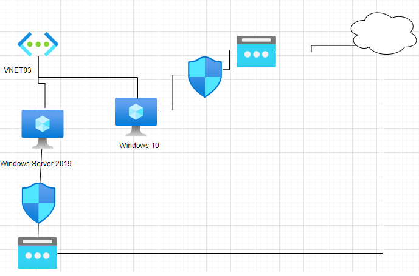

# Redes Virtuales en Azure

ALGO DE LITERATURA

Los pasos para dar respueta a la siguiente necesidad:




## Paso 1

Creación de nuestro grupo de recursos:


## Paso 2

Creación de la máquina virtual Windows Server 2019 DataCenter

vm19

## Sub paso 1

Creación de la red virtual **Vnet3**

Espacio de direcciones: 10.0.0.0/20

Subneting **subnet01**: 10.0.0.0/24

## Sub paso 2

Creación de la IP Pública

ws2019ip standard/static/Microsoft Network Routing

## Sub Paso 3

NGS (Network Security Group)

Puerto 80, 3389 (HTTP, RDP)

## Sub Paso 4

Tag (Etiqueta) : Departamento / Marqueting


# Paso 3

Crear el windows 10 

vmw10

## Sub paso 1

Relacionar la red virtual de vnet3

Relacionar la subnet con subnet01

## Sub paso 2

Creación de la ip pública 

w10ip standard/static/Microsoft Network Routing

P455wrd.rdP455wrd.rd

## Sub Paso 3

NGS (Network Security Group)

Puerto 3389 (RDP)

## Sub Paso 4

Tag (Etiqueta) : Departamento / Marqueting

P455wrd.rdP455wrd.rd


# Paso 4

Conexión con admin center

```
msiexec -i WindowsAdminCenter2211.msi productLanguage="1033"
```

El comando anterior lo utilizamos si hay diferencias con el windows y su lenguaje y el admin center.

Añadido Admin Center al AD Azure. (Inicio de seción en Azure desde Admin Center)

Habilitado los puertos de gestión de admin center en Windows 2019 maquina virtual

Revisar la pertenencia al role "Windows Admin Center Administrator Login" role

## Sub paso 1

Alternativa de gestion con server manager

Añadido un rol de **Web Server (IIS)**

Comprobado la pagina de inicio

```CD C:\inetpub\wwwroot```

Añadido un mensaje en la pagina de inicio


## Paso 5

Control gasto

Gastados hasta las 11:30 de 12/20/2022

63US$


